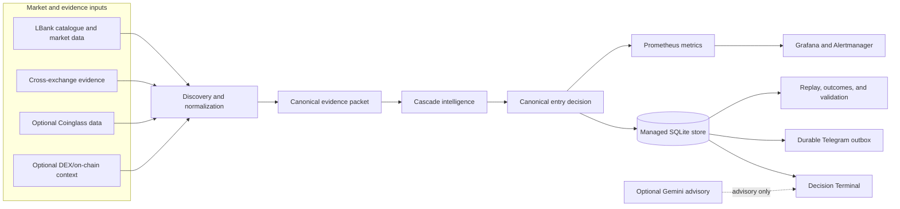

<div align="center">

# WaterfallHunter

**A canonical, decision-first terminal for SIGNAL_ONLY USDT perpetual-futures research.**

[](https://github.com/cavack/wfh/actions/workflows/ci.yml)


[Live Decision Terminal](https://waterfall.booksreadlive.online/dashboard) ·
[Architecture](docs/ARCHITECTURE.md) ·
[Decision contract](docs/DECISION_ENGINE.md) ·
[Developer onboarding](docs/DEVELOPER_ONBOARDING.md) ·
[Operations](docs/OPERATIONS.md)

</div>

> [!IMPORTANT]
> WaterfallHunter is `SIGNAL_ONLY`. `LIVE_TRADING_ENABLED=false` is mandatory, and the supported runtime does not place or cancel exchange orders. Only canonical `ENTRY_READY` is a proactive signal state. Research rankings, lifecycle labels, replay results, execution observations, historical outcomes, and AI output are non-actionable evidence surfaces.
<!-- alert-separator -->
> [!CAUTION]
> This repository is research software, not financial advice. `entry_readiness` is a versioned evidence score—not a probability, promise, or expected return.

## Contents

- [At a glance](#at-a-glance)
- [Why WaterfallHunter exists](#why-waterfallhunter-exists)
- [Canonical decision contract](#canonical-decision-contract)
- [System architecture](#system-architecture)
- [Product surfaces](#product-surfaces)
- [Evidence model](#evidence-model)
- [Scientific and promotion boundaries](#scientific-and-promotion-boundaries)
- [Repository map](#repository-map)
- [Quick start with Docker Compose](#quick-start-with-docker-compose)
- [Native development](#native-development)
- [Configuration contract](#configuration-contract)
- [API and health surface](#api-and-health-surface)
- [Data, schema, and recovery](#data-schema-and-recovery)
- [CI, release, and deployment](#ci-release-and-deployment)
- [Observability and incident response](#observability-and-incident-response)
- [Documentation index](#documentation-index)
- [Contributing](#contributing)
- [Non-goals](#non-goals)
- [License](#license)

## At a glance

| Contract | Current boundary |
| --- | --- |
| Product | Read-only decision terminal, evidence recorder, replay, outcomes, and operational diagnostics |
| Market | Linear USDT perpetual futures |
| Direction | Short-side cascade research only |
| Actionable state | `ENTRY_READY` only |
| Execution | No order placement or cancellation; execution evidence is observational |
| Runtime | Docker Compose behind nginx, with bounded systemd recovery |
| Application | FastAPI backend, Next.js frontend, Python watchdog |
| Persistence | Managed SQLite schema with durable decision, outcome, replay, and notification records |
| Observability | Prometheus, Grafana, Alertmanager, structured health/readiness endpoints |
| Optional integrations | Telegram notification delivery, Gemini advisory, and additional public-data providers |
| Safety posture | Fail closed on mandatory missing, stale, contradictory, or invalid evidence |

## Why WaterfallHunter exists

Crypto monitoring systems often mix discovery, ranking, lifecycle, research scores, and entry timing into one ambiguous list. WaterfallHunter keeps those concerns separate:

1. Discover eligible contracts and normalize market evidence.
2. Bind evidence to the correct economic contract and freshness window.
3. Build one canonical decision packet per symbol.
4. Evaluate hard invalidators, anti-chase, timing, and weighted evidence.
5. Emit one public entry decision with explicit reasons and blockers.
6. Persist transitions, outcomes, replay evidence, and notification state.
7. Present actionability before research detail.

The result is deliberately conservative: a high research score, an interesting lifecycle stage, or a model advisory can never silently become an entry command.

## Canonical decision contract

Every evaluated symbol receives exactly one public entry state:

| State | Meaning | Enter now? |
| --- | --- | :---: |
| `NO_TRADE` | Evidence does not support a valid setup, or a deterministic veto applies | No |
| `FORMING` | Evidence is developing but the canonical entry contract is incomplete | No |
| `ENTRY_READY` | Timing, direction, execution geometry, freshness, and mandatory checks pass | **Canonical signal state** |
| `ACTIVE` | A previously emitted entry-ready setup is now in progress | No new entry instruction |
| `LATE` | The move is too extended or the entry window has passed | No |
| `INVALIDATED` | A previously valid setup has failed an explicit invariant | No |
| `EXPIRED` | The decision aged beyond its valid horizon | No |
| `UNAVAILABLE` | Required evidence or runtime state cannot be established honestly | No |

Lifecycle is a separate context model:

```text
WATCH → FUEL-RICH → PRE-TRIGGER → ARMED → TRIGGERED → EXHAUSTED
                                      ↘ INVALIDATED
```

Lifecycle `TRIGGERED` does not mean `ENTRY_READY`. An immutable entry event cannot silently disappear; later changes are recorded as explicit transitions with timestamps, reason codes, model/evidence version, and provenance.

Read the full contracts in [Decision Engine](docs/DECISION_ENGINE.md), [Model](docs/MODEL.md), and [Dashboard](docs/DASHBOARD.md).

## System architecture



Runtime topology:

```text
browser → nginx → Next.js frontend → FastAPI backend → managed SQLite volume
                                  ↘ watchdog / Prometheus / Grafana / Alertmanager
```

The frontend is the public edge. The backend and stateful services remain on internal Compose networks. Container filesystems are read-only where practical, Linux capabilities are dropped, `no-new-privileges` is enabled, logs are bounded, and persistent state is isolated in named volumes.

## Product surfaces

### Decision Terminal

The [live dashboard](https://waterfall.booksreadlive.online/dashboard) is ordered by decision safety rather than raw rank:

- canonical counts for `ENTRY_READY`, `FORMING`, `ACTIVE`, and blocked/other states;
- at most three `ENTRY_READY` cards;
- at most six nearest `FORMING` cards;
- explicit no-signal and dominant-blocker explanations;
- recent decision transitions;
- searchable, filterable, paginated all-candidates table;
- price, OI, funding, taker flow, cascade, spread, cross-exchange, freshness, anti-chase, and execution-plan context where available.

When nothing is ready, the terminal says so. It does not turn a top-ranked observational list into a trading cue.

### Research and validation

Secondary panels are collapsed and loaded on demand. They include:

- production evidence recorder status;
- feature-equivalent replay;
- natural and imported historical outcomes;
- execution-suitability and execution-outcome observations;
- lifecycle-v2 shadow evidence;
- signal-funnel diagnostics;
- bounded Backtest Lab workflows.

These surfaces explain and validate the system; they cannot create, veto, promote, or downgrade a canonical signal.

### Notification and advisory boundaries

- Telegram is notification-only. Canonical events use a durable outbox with leases, retries, rate-limit handling, dead-letter state, and a release-scoped cutover boundary.
- Gemini is optional advisory context. Missing credentials or provider failure yields `UNAVAILABLE`; deterministic evaluation continues.
- No local model runtime is required by the canonical architecture.

## Evidence model

WaterfallHunter combines evidence families without pretending that every optional source is always present:

| Evidence family | Examples | Safety treatment |
| --- | --- | --- |
| Market identity | symbol, venue, contract type, quote/settlement asset | Contract mismatch can invalidate the packet |
| Structure and timing | price behavior, breakdown geometry, extension | Drives timing and mandatory anti-chase checks |
| Derivatives | open interest, funding, crowding | Weighted evidence; freshness and provenance are explicit |
| Aggressive flow | taker imbalance, CVD-like observations | Supports or contradicts directional evidence |
| Liquidation/cascade | observed liquidation flow and cascade context | Observed and estimated evidence are labelled separately |
| Liquidity/execution | spread, depth, slippage geometry, venue constraints | Invalid geometry can block actionability |
| Cross-exchange | agreement for the same economic contract | Contradictory fresh identity/evidence can invalidate |
| Relative context | market regime and relative weakness | Contextual evidence, never a standalone command |

Missing optional evidence lowers coverage. Missing mandatory evidence produces an explicit blocker or `UNAVAILABLE`; it is never silently replaced with synthetic market data.

## Scientific and promotion boundaries

- `entry_readiness` is a versioned readiness score, not a calibrated probability.
- Deterministic fixtures and golden replay corpora are regression evidence, not live profitability evidence.
- Imported historical datasets and naturally observed production outcomes remain distinct.
- New thresholds and evidence families require provenance, replay, walk-forward/holdout evaluation, and explicit promotion evidence.
- Experimental pre-triggers remain observational and cannot place orders or bypass canonical decisions.
- Execution suitability cannot become a signal gate without its own calibrated promotion contract.

See [Strict Scientific Validation](docs/strict-scientific-validation.md), [Feature-equivalent Replay](docs/feature-equivalent-replay.md), and [Operational Historical Outcomes](docs/operational-historical-outcomes.md).

## Repository map

| Path | Responsibility |
| --- | --- |
| [`backend/`](backend/) | FastAPI application, discovery, evidence normalization, decision engine, persistence, migrations, replay, outcomes, and APIs |
| [`frontend/`](frontend/) | Next.js Decision Terminal and lazily mounted research panels |
| [`watchdog/`](watchdog/) | Health watcher, heartbeat, and optional alert/notification bridge |
| [`deploy/`](deploy/) | nginx, systemd, Prometheus, Grafana, and Alertmanager assets |
| [`scripts/`](scripts/) | Validation, backup, migration, replay, calibration, certification, and release tooling |
| [`docs/`](docs/) | Canonical product, engineering, data, scientific, and operational documentation |
| [`research/`](research/) | Curated research inputs; generated outputs and datasets stay out of Git |
| [`skills/waterfallhunter/`](skills/waterfallhunter/) | Repository-local engineering workflows and verification contracts |
| [`.github/workflows/`](.github/workflows/) | Exact-SHA CI artifact construction and guarded production deployment |

## Quick start with Docker Compose

### Prerequisites

- Git
- Docker Engine with Compose v2
- Enough local resources to build the backend, frontend, and watchdog images

```bash
git clone https://github.com/cavack/wfh.git
cd wfh
cp .env.example .env

# Validate the resolved configuration before starting anything.
docker compose config --quiet

# Build the backend image, then bootstrap the managed SQLite schema
# in the persistent waterfall_data volume before runtime startup.
docker compose build waterfall-backend
docker compose run --rm waterfall-backend \
  python -m waterfallhunter.migrate_database \
  --db-path /app/data/waterfall_registry.db \
  --apply --source-revision "$(git rev-parse HEAD)"

# Build the remaining images and start the local SIGNAL_ONLY stack.
docker compose up --build -d
docker compose ps
```

Local interfaces bind to loopback by default:

| Surface | URL |
| --- | --- |
| Decision Terminal | `http://127.0.0.1:3000/dashboard/` |
| Grafana | `http://127.0.0.1:3001/` |

Stop containers without deleting persistent state:

```bash
docker compose down
```

> [!WARNING]
> Do not use `docker compose down -v` against a stack whose SQLite volume matters. The `-v` option removes named volumes and can destroy the only local database copy.

## Native development

Canonical runtimes are recorded in [`.github/runtime-versions.json`](.github/runtime-versions.json): Python 3.13 and Node.js 26.

```bash
make setup
make validate
```

Individual developer commands:

```bash
make test
make typecheck
make build
```

A partial direct sequence for backend/frontend tests and build is:

```bash
python -m pip install --only-binary=:all: --require-hashes -r backend/requirements.lock
PYTHONPATH=backend/src:. pytest -q backend/tests

npm --prefix frontend ci
npm --prefix frontend run test:contract
npm --prefix frontend run typecheck
npm --prefix frontend run build
```

The release-candidate validator requires a clean committed SHA. It exports that exact revision, validates Compose, builds the production image family, executes backend tests inside the built backend image, applies migrations to a throwaway SQLite database, and verifies OCI revision labels. It never starts Production or mounts the Production database.

```bash
./scripts/validate_clean_install.sh
```

## Configuration contract

Copy [`.env.example`](.env.example) for local development. Never commit the resulting `.env`.

| Variable | Default | Contract |
| --- | --- | --- |
| `LIVE_TRADING_ENABLED` | `false` | Mandatory invariant; the supported runtime is signal-only |
| `REGISTRY_DB_PATH` | `/app/data/waterfall_registry.db` | Managed SQLite database path inside the backend container |
| `EXPERIMENTAL_PRETRIGGER_ENABLED` | `false` | Observational discovery only; never order execution |
| `LBANK_EXECUTION_SHADOW_ENABLED` | `false` in `.env.example` | Read-only execution observation; Compose may explicitly enable the worker |
| `TELEGRAM_SIGNAL_DELIVERY_ENABLED` | `false` | Requires credentials and a release-scoped cutover timestamp |
| `GEMINI_API_KEY` | empty | Optional advisory provider; absence does not break deterministic evaluation |
| `COINGLASS_API_KEY` | empty | Optional external evidence provider |
| `DEXSCREENER_ENABLED` | `false` | Optional contextual discovery path |
| `BACKTEST_ARTIFACT_HMAC_KEY` | empty | Optional signing key for bounded backtest artifacts |

Provider credentials, chat identifiers, production environment files, database files, evidence packets, logs, backups, and generated research datasets must never be committed.

## API and health surface

Common backend routes:

| Route | Purpose |
| --- | --- |
| `GET /livez` | Process liveness only |
| `GET /readyz` | Scanner, hunter, database, and runtime-progress readiness |
| `GET /healthz` | Readiness-compatible health alias |
| `GET /api/health` | Structured application health snapshot |
| `GET /api/candidates` | Canonical dashboard snapshot |
| `GET /api/stream` | Server-Sent Events dashboard stream with replay support |
| `GET /api/recent-signals` | Durable recent canonical signal history |
| `GET /api/notification-delivery` | Durable notification/outbox health |
| `GET /api/production-evidence` | Recorder and production-evidence report |
| `GET /api/feature-replay` | Feature-equivalent replay report |
| `GET /api/historical-outcomes` | Historical-outcome datasets and summaries |
| `GET /api/execution-suitability` | Read-only execution-suitability report |
| `GET /api/execution-outcome-validation` | Execution-observation validation report |
| `GET /api/lifecycle-v2-shadow` | Lifecycle-v2 shadow evidence |
| `GET /metrics` | Prometheus metrics |

When accessed through the public Next.js frontend, API paths are exposed under the dashboard base path—for example, `/dashboard/api/health`. Research endpoints are requested only when their corresponding UI section is opened.

## Data, schema, and recovery

- The application database lives in the `waterfall_data` volume, not in Git.
- Schema ownership is migration-based; the current migration chain lives under [`backend/src/waterfallhunter/migrations/`](backend/src/waterfallhunter/migrations/).
- Runtime startup fails closed on unsupported or inconsistent schema state.
- A production migration requires a certified backup, preflight, isolated rehearsal, and rollback evidence.
- Restore is always performed into a new file or volume first. The only good backup is never overwritten.
- SQLite backup equality is established through integrity and logical-content evidence, not by assuming raw online-backup bytes must match.
- A bounded recovery set normally retains two certified backups, including a valid pre-migration recovery point until post-cutover certification completes.

Read [Data and Database](docs/DATA_AND_DATABASE.md), [Backup and Restore](docs/BACKUP_RESTORE.md), and the [Deployment Certification Runbook](docs/operations/deployment-certification-runbook.md) before any schema, cutover, cleanup, or restore operation.

## CI, release, and deployment

The `CI` workflow runs:

- locked Python installation and the backend test suite;
- WaterfallHunter skill and runtime-parity validation;
- frontend contract tests, typechecking, and production build;
- Python and npm dependency audits;
- Compose validation and production image builds;
- backend tests and migration smoke tests inside the exact backend artifact;
- OCI revision-label verification;
- repository hygiene and credential-pattern checks;
- upload of the exact built, digest-recorded, revision-labelled backend/frontend/watchdog image bundle; the backend artifact is additionally exercised by backend tests and migration smoke.

Production deployment is deliberately separate from an ordinary push:

```text
protected main
  → exact-SHA CI
  → backup / migration / rollback / recovery gates
  → explicit workflow_dispatch with deploy_production=true
  → repeated required checks
  → exact CI-built, digest-recorded artifact bundle
  → guarded host deployment
  → health, schema, safety, and OCI revision certification
```

Pull requests do not receive production credentials. A push to `main` runs CI but does not deploy. Rollback is allowed only when schema compatibility is proven; otherwise the runtime is quarantined and recovery evidence is preserved.

See [Deployment](docs/DEPLOYMENT.md), [Operations](docs/OPERATIONS.md), and [Automatic Production Deployment](docs/operations/automatic-production-deployment.md).

## Observability and incident response

- `/livez` answers only whether the process is alive.
- readiness endpoints include scanner catalogue freshness, hunter progress, database readiness, and read-only execution-shadow progress.
- Prometheus records candidate states, evidence quality, cycle progress, notification health, and service metrics.
- Grafana provides dashboards; Alertmanager and the watchdog provide bounded health alerting.
- Container logs use bounded JSON-file rotation.
- systemd asserts the canonical Compose stack after boot and uses bounded recovery rather than unlimited restart loops.

Healthy endpoints do not by themselves prove decision correctness, backup validity, schema compatibility, or release readiness. Those are separate evidence gates.

## Documentation index

| Topic | Canonical document |
| --- | --- |
| New developer or AI-session handoff | [Project Handoff](docs/PROJECT_HANDOFF.md) |
| Runtime topology and data flow | [Architecture](docs/ARCHITECTURE.md) |
| Market and evidence rules | [Model](docs/MODEL.md) |
| Entry states and readiness | [Decision Engine](docs/DECISION_ENGINE.md) |
| Dashboard information architecture | [Dashboard](docs/DASHBOARD.md) |
| SQLite ownership and schema lineage | [Data and Database](docs/DATA_AND_DATABASE.md) |
| Local setup | [Developer Onboarding](docs/DEVELOPER_ONBOARDING.md) |
| Runtime operations | [Operations](docs/OPERATIONS.md) |
| Production release | [Deployment](docs/DEPLOYMENT.md) |
| Recovery | [Backup and Restore](docs/BACKUP_RESTORE.md) |
| Notification boundary | [Telegram](docs/TELEGRAM.md) |
| Advisory boundary | [AI Advisory](docs/AI_ADVISORY.md) |
| Common failures | [Troubleshooting](docs/TROUBLESHOOTING.md) |
| Program sequencing | [Dependency Graph](docs/program/DEPENDENCY_GRAPH.md) |

## Contributing

1. Start from current `main` in a short-lived branch or isolated worktree.
2. Keep changes narrow and add focused regression coverage for behavior changes.
3. Preserve `SIGNAL_ONLY`, canonical state semantics, and fail-closed data handling.
4. Use migration and backup/rehearsal coverage for persistent-schema changes.
5. Run `make validate`; run `./scripts/validate_clean_install.sh` for a clean release-candidate commit.
6. Open a reviewed pull request and require exact-head CI before merge.

Read [CONTRIBUTING.md](CONTRIBUTING.md) and [SECURITY.md](SECURITY.md) before submitting changes or reporting a vulnerability.

## Non-goals

The supported runtime intentionally does not provide:

- exchange order placement, cancellation, or account management;
- automatic threshold promotion from replay or historical results;
- a claim that readiness is a calibrated probability;
- synthetic fallback market data when required evidence is missing;
- AI authority over canonical decisions;
- unreviewed push-to-production deployment;
- destructive database cleanup without certified recovery evidence.

## License

Copyright © 2026 cavack. All rights reserved.

The source is publicly viewable for inspection and collaboration, but no permission is granted to copy, modify, distribute, sublicense, sell, or use the software or substantial portions of it without prior written permission from the copyright holder. See [LICENSE](LICENSE) for the controlling terms.
