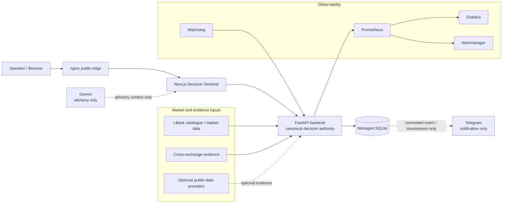

# D01 — System Context

Source baseline: `main@65c063ffea6209ecd84b224656bbc627ff811898`

## Purpose

Show the system-level boundary of WaterfallHunter: public operator access, the Decision Terminal, canonical backend, managed persistence, external evidence providers, downstream notification, optional advisory, and observability.

Authoritative references: `README.md`, `docs/ARCHITECTURE.md`, `docs/OPERATIONS.md`.

## Interpretation

- The backend is the canonical decision authority; neither Telegram nor Gemini defines `EntryDecision`.
- External providers contribute evidence only after normalization, contract-identity checks, freshness checks, and the relevant fail-closed rules.
- Durable state lives in managed SQLite; the frontend is a Decision Terminal over canonical backend contracts.
- Observability is operational control-plane context, not trading/decision evidence.

## Safety boundary

WaterfallHunter is `SIGNAL_ONLY`. `LIVE_TRADING_ENABLED=false` is mandatory, and no order-placement or cancellation path exists in this diagram.
