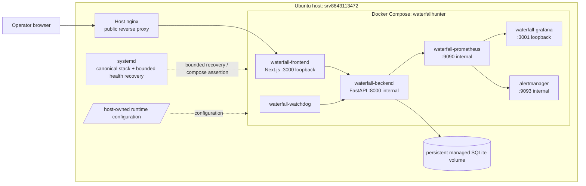

# D02 — Runtime Deployment Topology

Source baseline: `main@65c063ffea6209ecd84b224656bbc627ff811898`

Runtime reconciliation: read-only inspection of `srv8643113472` at implementation time.

## Purpose

Show the deployed host/container boundary, public edge, loopback/public surfaces, internal application services, persistent data, and bounded host recovery controls.

Authoritative references: `docs/OPERATIONS.md`, `docker-compose.yml`, production Compose labels and read-only runtime inspection.

## Runtime facts observed read-only

- Checkout: `/srv/waterfallhunter/app` at detached `65c063ffea6209ecd84b224656bbc627ff811898`.
- Backend, frontend, watchdog, Prometheus, Grafana, and Alertmanager were running; backend reported healthy.
- nginx was active on the host.
- `LIVE_TRADING_ENABLED=false`; `LBANK_EXECUTION_SHADOW_ENABLED=true`.
- The runtime uses `docker-compose.yml` plus the host-owned `/srv/waterfallhunter/runtime/production-volumes.override.yml` topology override.

## Operational notes

The persistent data volume survives ordinary runtime replacement. `docker compose down -v` is outside the supported recovery path because removing named volumes can destroy persistent database state.

## Safety boundary

This topology is `SIGNAL_ONLY`; no container or host service shown here is an exchange order executor.
