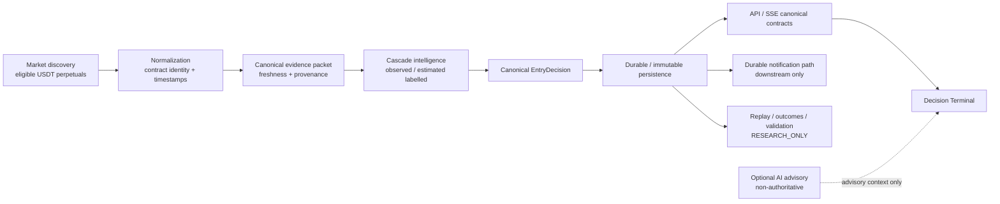

# D03 — End-to-End Data Pipeline

Source baseline: `main@65c063ffea6209ecd84b224656bbc627ff811898`

## Purpose

Show how raw market/provider observations become canonical evidence, a public `EntryDecision`, durable state, product delivery, and separate research/validation evidence.

Authoritative references: `README.md`, `docs/ARCHITECTURE.md`, `docs/MODEL.md`, `docs/DECISION_ENGINE.md`.

## Interpretation

- Contract identity, freshness, provenance, and evidence availability are established before public decision semantics are exposed.
- `EntryDecision` is the single public actionability contract. Lifecycle labels and research rankings remain contextual evidence.
- Durable persistence is upstream of notification delivery.
- Replay, historical outcomes, scientific validation, and AI advisory do not feed directly into proactive actionability.

## Safety boundary

Only canonical `ENTRY_READY` is a proactive signal state. This pipeline contains no order-placement or cancellation stage.
