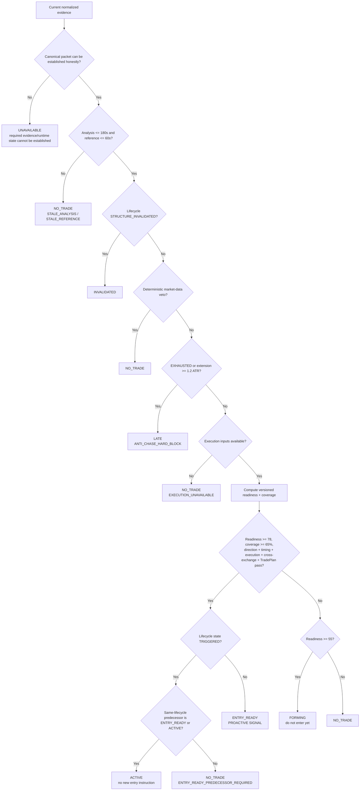

# D04 — Canonical Decision Flow

Source baseline: `main@65c063ffea6209ecd84b224656bbc627ff811898`

## Purpose

Show the current `entry_decision_v1` policy as a fail-closed decision flow without collapsing lifecycle context into actionability.

Authoritative references: `backend/src/waterfallhunter/core/entry_decision.py`, `docs/DECISION_ENGINE.md`, `docs/MODEL.md`.

## Current policy values

- `forming_minimum = 55.0`
- `entry_ready_minimum = 78.0`
- `max_analysis_age_seconds = 180.0`
- `max_reference_age_seconds = 60.0`
- `anti_chase_hard_block_atr = 1.2`
- Entry readiness additionally requires at least `65%` evidence coverage and passing direction, timing, execution, cross-exchange, and TradePlan gates.

## Important nuance

`UNAVAILABLE` belongs to the public EntryDecision contract for cases where required evidence/runtime state cannot be established honestly. Inside `build_entry_decision`, stale analysis/reference and unavailable execution inputs are explicit blockers that produce `NO_TRADE`; the diagram keeps those paths distinct rather than pretending every missing input maps to the same state.

A lifecycle state of `TRIGGERED` does not create an entry instruction. The current engine may emit `ACTIVE` only when a same-lifecycle prior decision was already `ENTRY_READY` or `ACTIVE`; otherwise it fails closed.
