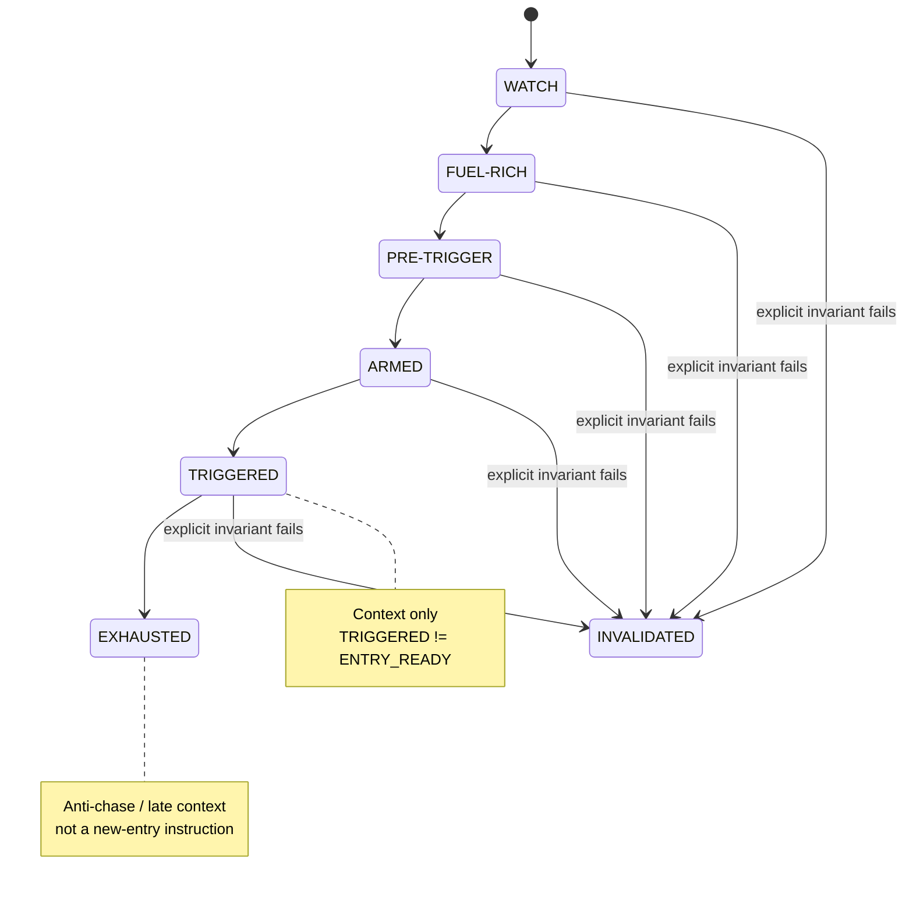

# D05 — Lifecycle State Machine

Source baseline: `main@65c063ffea6209ecd84b224656bbc627ff811898`

## Purpose

Show WaterfallHunter's lifecycle as contextual evidence progression, independently from the public `EntryDecision` contract.

Authoritative references: `README.md`, `docs/ARCHITECTURE.md`, `docs/MODEL.md`, lifecycle code/tests.

## Interpretation

- Lifecycle answers **where the setup is in its evolution**, not whether the operator should enter now.
- `TRIGGERED` is not actionable by itself. The canonical public actionability contract is `EntryDecision`, and only `ENTRY_READY` is proactive.
- `EXHAUSTED` is terminal late/chase context for the lifecycle path.
- Invalidation reason codes and persistence semantics remain defined by the current lifecycle implementation; the diagram intentionally avoids duplicating those internals.
