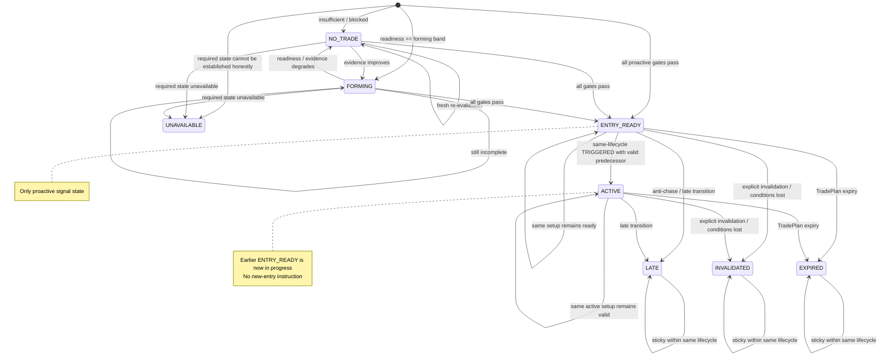

# D06 — EntryDecision State Machine

Source baseline: `main@65c063ffea6209ecd84b224656bbc627ff811898`

## Purpose

Show the user-facing `entry_decision_v1` states and the persistence rules that make a previously actionable event explicit rather than silently disappearing.

Authoritative references: `backend/src/waterfallhunter/core/entry_decision.py`, `backend/src/waterfallhunter/core/entry_decision_store.py`, `docs/DECISION_ENGINE.md`.

## Transition semantics

- The current engine treats prior `ENTRY_READY`/`ACTIVE` decisions specially: expiry becomes explicit `EXPIRED`; invalidation becomes explicit `INVALIDATED`; late anti-chase conditions become `LATE`.
- A lifecycle `TRIGGERED` evaluation may become `ACTIVE` only when a same-lifecycle predecessor is already `ENTRY_READY` or `ACTIVE`. Without that predecessor, it fails closed with `ENTRY_READY_PREDECESSOR_REQUIRED`.
- `LATE`, `INVALIDATED`, and `EXPIRED` are sticky for the same lifecycle identity. A distinct lifecycle can start a fresh evaluation rather than silently rewriting the earlier event.
- Non-actionable states are recomputed from current evidence; exact reason codes remain in the canonical packet and durable transition history.
