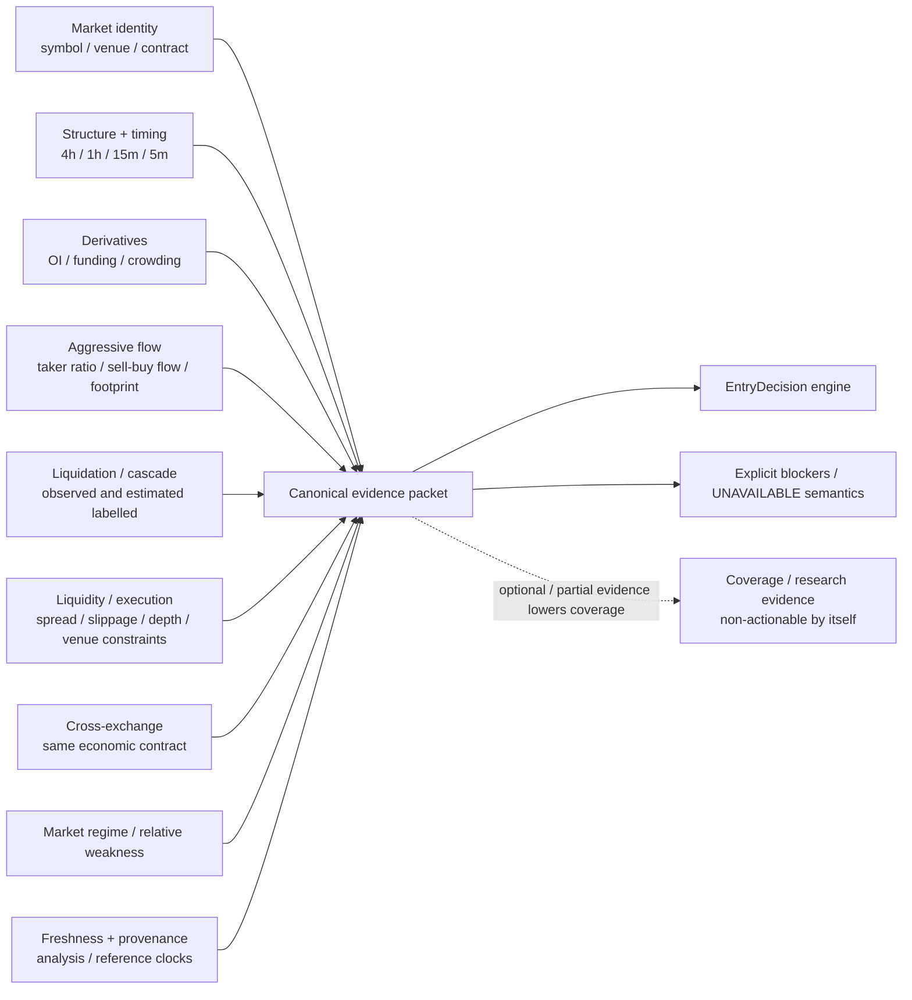

# D07 — Evidence Architecture

Source baseline: `main@65c063ffea6209ecd84b224656bbc627ff811898`

## Purpose

Show the evidence families WaterfallHunter reconciles into one canonical packet before public decision semantics are evaluated.

Authoritative references: `docs/MODEL.md`, `README.md`, `backend/src/waterfallhunter/core/entry_decision.py`, market-data/validator modules.

## Evidence treatment

- **Mandatory safety/identity/freshness failures** can block actionability or make required state unavailable according to the owning contract.
- **Optional missing evidence** lowers available coverage; absence is never converted into bearish or bullish evidence.
- Cross-exchange confirmation must refer to the same economic contract.
- Estimated future liquidation zones must remain labelled estimated; they are not presented as exchange-observed heatmap facts.
- Research coverage, lifecycle context, historical outcomes, and advisory material cannot bypass the canonical `EntryDecision` path.

## Current EntryDecision component families

The current `entry_decision_v1` implementation scores source-grounded components named `structure`, `timing`, `order_flow`, `derivatives`, `execution`, `cross_exchange`, `price_location`, and `cascade`. The broader evidence diagram additionally shows identity, regime/relative context, and freshness/provenance because they govern packet validity/context even when they are not a weighted component with the same name.
