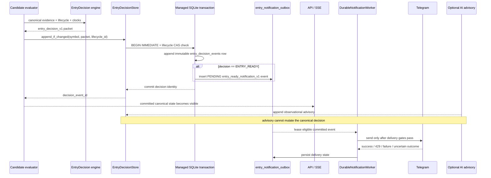

# D08 — Entry Decision Transaction Sequence

Source baseline: `main@65c063ffea6209ecd84b224656bbc627ff811898`

## Purpose

Show the exact persistence-before-notification boundary for canonical entry decisions and the observational-only AI advisory path.

Authoritative references: `backend/src/waterfallhunter/core/entry_decision.py`, `backend/src/waterfallhunter/core/entry_decision_store.py`, migration `0006_entry_decisions.sql`, migration `0007_entry_decision_advisories.sql`.

## Transaction boundary

`EntryDecisionStore.append_if_changed()` opens `BEGIN IMMEDIATE`, validates the expected catalogue lifecycle, appends the immutable `entry_decision_events` row, and—only for `ENTRY_READY`—inserts the corresponding `entry_notification_outbox` row before the transaction completes. If the store returns no committed event identity, there is no canonical network notification material to send.

## Advisory boundary

AI advisory rows are persisted separately in `entry_decision_advisories`. The store requires `observational_only=true` and `decision_mutated=false`; an unavailable advisory can be materialized without blocking canonical delivery after the configured grace window.

## Safety boundary

Notification is downstream of committed decision state. Delivery success/failure cannot redefine `EntryDecision`, and there is no order-placement step in this sequence.
