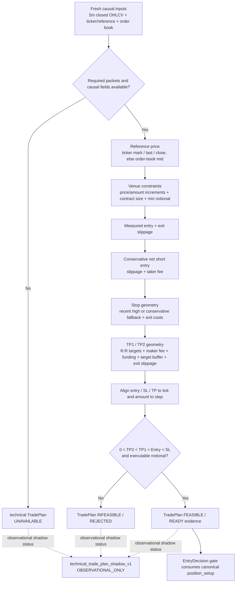

# D09 — TradePlan / Risk Flow

Source baseline: `main@65c063ffea6209ecd84b224656bbc627ff811898`

## Purpose

Show how current, causal execution evidence is transformed into a conservative short-side TradePlan/technical feasibility packet without implying order execution.

Authoritative references: `backend/src/waterfallhunter/core/position_calculator.py`, `backend/src/waterfallhunter/core/multi_exchange_validator.py`, `backend/src/waterfallhunter/core/entry_decision.py`.

## Current calculation semantics

- `PositionCalculator.calculate_short_position()` uses a short-side stop-first risk model.
- Entry accounts for measured entry slippage plus taker fee.
- Stop loss uses a recent high when valid, otherwise a conservative percentage fallback, then includes measured exit slippage and fee in the risk calculation.
- TP1 targets approximately `1R`; TP2 uses the calculator's target R:R (currently `2R`) and includes maker fee, funding, target buffer, and exit slippage carrying cost.
- Raw and tick-aligned short geometry must remain strictly ordered; invalid or collapsed geometry fails closed.
- Contract tick/step increments, contract size, and minimum notional are applied before status becomes `READY`.
- Monitoring semantics identify best-ask TP and mark-price stop sources.

## Technical TradePlan shadow

Production Evidence v9 also records `technical_trade_plan_shadow_v1` through the same canonical `PositionCalculator`. That shadow is explicitly `observational_only=true`, `hard_gating_allowed=false`, and `trade_eligible=false`; it may report `UNAVAILABLE`, `INFEASIBLE`, or `FEASIBLE` without changing the canonical decision contract.

## Safety boundary

A feasible TradePlan is evidence/geometry, not an order. WaterfallHunter remains `SIGNAL_ONLY` and never places or cancels exchange orders.
