# D10 — Persistence ERD

Source baseline: `main@65c063ffea6209ecd84b224656bbc627ff811898`

## Purpose

Show only the domain-critical foreign-key relationships in the managed SQLite schema through migration `0007`. This is intentionally not a dump of every runtime table.

Authoritative references: migrations `0001` through `0007`, `backend/src/waterfallhunter/core/entry_decision_store.py`, schema-contract/store code.

```mermaid
erDiagram
    LBANK_SIGNAL_LEDGER {
        int id PK
        text symbol
        int triggered_at
        real score
    }

    SIGNAL_METADATA {
        int signal_id PK,FK
        text signal_class
        text strategy_profile
        text score_version
        text decision_contract_hash
    }

    SIGNAL_DECISIONS {
        int signal_id PK,FK
        text decision_id UK
        text decision_status
        text payload_hash
    }

    DOMAIN_OUTBOX_EVENTS {
        text event_id PK
        int signal_id FK
        text event_key UK
        text status
        int attempt_count
    }

    LBANK_SIGNAL_OUTCOMES {
        int id PK
        int signal_id FK,UK
        text outcome_status
        int resolved_at
    }

    ENTRY_DECISION_EVENTS {
        int id PK
        text symbol
        int event_at
        text decision
        text packet_hash
    }

    ENTRY_NOTIFICATION_OUTBOX {
        text event_id PK
        int decision_event_id FK
        text status
        int attempt_count
    }

    ENTRY_DECISION_ADVISORIES {
        int id PK
        int decision_event_id FK
        text status
        text advisory_hash
    }

    PRODUCTION_EVIDENCE_SNAPSHOTS {
        int id PK
        text symbol
        real observed_at
        text evidence_sha256
        text schema_version
    }

    PRODUCTION_FEATURE_REPLAY_RESULTS_V2 {
        int id PK
        int snapshot_id FK
        text replay_version
        text status
        int strategy_equivalent
    }

    OPERATIONAL_HISTORICAL_OUTCOME_DATASETS {
        int id PK
        text report_sha256 UK
        int window_start_ms
        int window_end_ms
    }

    OPERATIONAL_HISTORICAL_SIGNAL_OUTCOMES {
        int id PK
        int dataset_id FK
        text event_key UK
        text symbol
        real net_realized_r
    }

    LBANK_SIGNAL_LEDGER ||--|| SIGNAL_METADATA : "FOREIGN_KEY signal_id"
    LBANK_SIGNAL_LEDGER ||--o| SIGNAL_DECISIONS : "FOREIGN_KEY signal_id"
    LBANK_SIGNAL_LEDGER ||--o{ DOMAIN_OUTBOX_EVENTS : "FOREIGN_KEY signal_id"
    LBANK_SIGNAL_LEDGER ||--o| LBANK_SIGNAL_OUTCOMES : "FOREIGN_KEY signal_id + UNIQUE"

    ENTRY_DECISION_EVENTS ||--o| ENTRY_NOTIFICATION_OUTBOX : "FOREIGN_KEY decision_event_id"
    ENTRY_DECISION_EVENTS ||--o{ ENTRY_DECISION_ADVISORIES : "FOREIGN_KEY decision_event_id"

    PRODUCTION_EVIDENCE_SNAPSHOTS ||--o{ PRODUCTION_FEATURE_REPLAY_RESULTS_V2 : "FOREIGN_KEY snapshot_id"
    OPERATIONAL_HISTORICAL_OUTCOME_DATASETS ||--o{ OPERATIONAL_HISTORICAL_SIGNAL_OUTCOMES : "FOREIGN_KEY dataset_id"
```

## Relationship classification

| Relationship | Classification | Source |
| --- | --- | --- |
| `signal_metadata.signal_id -> lbank_signal_ledger.id` | `FOREIGN_KEY` | migration 0003 |
| `signal_decisions.signal_id -> lbank_signal_ledger.id` | `FOREIGN_KEY` | migration 0004 |
| `domain_outbox_events.signal_id -> lbank_signal_ledger.id` | `FOREIGN_KEY` | migration 0004 |
| `lbank_signal_outcomes.signal_id -> lbank_signal_ledger.id` | `FOREIGN_KEY` + unique | migration 0002 |
| `entry_notification_outbox.decision_event_id -> entry_decision_events.id` | `FOREIGN_KEY` | migration 0006 |
| `entry_decision_advisories.decision_event_id -> entry_decision_events.id` | `FOREIGN_KEY` | migration 0007 |
| `production_feature_replay_results_v2.snapshot_id -> production_evidence_snapshots.id` | `FOREIGN_KEY` | migration 0002 |
| `operational_historical_signal_outcomes.dataset_id -> operational_historical_outcome_datasets.id` | `FOREIGN_KEY` | migration 0002 |

## Important logical links not rendered as relational constraints

- `lbank_catalog` and `lbank_stage_lifecycle` share symbol/lifecycle identity but the baseline schema does not declare a foreign key between them.
- `lifecycle_v2_shadow_events` is immutable shadow evidence with `episode_id`, `symbol`, hashes, `shadow_only=1`, and `promotion_allowed=0`; migration 0005 declares no foreign key to the canonical signal/entry tables.
- `entry_decision_events` and the older confirmed-signal ledger are separate persisted domains; no schema foreign key connects them, so the ERD does not invent one.
- `canonical_signal_view` is an inner-join view over `lbank_signal_ledger` and `signal_metadata`; it is not a stored entity.
- `db_readiness_probe` is operational schema-readiness infrastructure and is omitted from the domain graph.

## Immutability

The schema uses update/delete triggers to protect signal metadata, confirmed decisions, outcome evidence, replay evidence, entry-decision events, notification material, advisories, and other append-only records. Delivery-state columns on outbox tables may advance while immutable event material remains protected.
