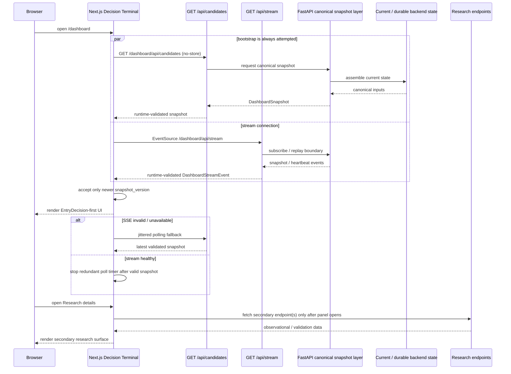

# D11 — Dashboard / API / SSE

Source baseline: `main@65c063ffea6209ecd84b224656bbc627ff811898`

## Purpose

Show the current Decision Terminal transport contract: schema-validated bootstrap polling, validated SSE events/replay, monotonic snapshot versions, fallback polling, and lazy research loading.

Authoritative references: `frontend/app/page.tsx`, dashboard contract code, backend dashboard/SSE routes, `docs/DASHBOARD.md`.

## Current frontend behavior

- The browser opens `EventSource("/dashboard/api/stream")` and also schedules an immediate `/dashboard/api/candidates` bootstrap poll. An open heartbeat-only stream therefore cannot suppress the initial schema-valid snapshot.
- Both polling snapshots and stream events cross explicit runtime contract validators before being accepted.
- `snapshot_version` is monotonic on the client; older/equal snapshots are ignored.
- Stream failure switches to reconnecting state and schedules jittered/exponential polling fallback; polling settles to a 5-second cadence while the stream is unavailable.
- Named `snapshot` and `heartbeat` SSE events are supported.
- Research/validation diagnostics are mounted only when the collapsed Research section is opened, reducing hidden background polling/work.

## Decision boundary

The frontend renders canonical backend contracts. This transport diagram contains no client-side EntryDecision, eligibility, or ranking authority. Research panels are explicitly secondary and never an entry command.
