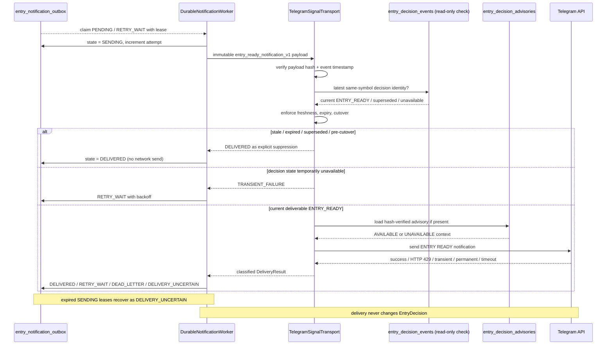

# D12 — Durable Notification Delivery

Source baseline: `main@65c063ffea6209ecd84b224656bbc627ff811898`

## Purpose

Show the canonical proactive Telegram path owned by the durable `ENTRY_READY` outbox worker, including cutover, freshness/supersession checks, leases, retries, rate limiting, uncertainty, and dead-letter state.

Authoritative references: `backend/src/waterfallhunter/core/entry_decision_store.py`, `backend/src/waterfallhunter/core/notification_delivery.py`, `backend/src/waterfallhunter/core/notifier.py`, migration `0006_entry_decisions.sql`.

## Durable worker states

`entry_notification_outbox.status` is constrained to:

`PENDING | SENDING | DELIVERED | RETRY_WAIT | DEAD_LETTER | DELIVERY_UNCERTAIN`.

- Eligible events are leased with compare-and-set semantics.
- HTTP `429` becomes `RETRY_WAIT` using `retry_after` when available and stops the current drain loop from hammering Telegram.
- Other transient failures use bounded exponential backoff with jitter.
- Permanent failures or exhausted attempts become `DEAD_LETTER`.
- A timeout or expired lease after a send may have started becomes `DELIVERY_UNCERTAIN`, avoiding an unsafe assumption about external side effects.

## Canonical delivery gate

`TelegramSignalTransport` verifies the immutable payload hash, rejects future-dated events, suppresses expired/stale or superseded `ENTRY_READY` events, enforces the release-scoped cutover, and checks that the durable decision identity is still the latest `ENTRY_READY` for the symbol before network send.

AI advisory is optional context. Missing advisory material becomes `UNAVAILABLE`; it cannot veto or mutate the canonical decision.

## Legacy compatibility

The older `domain_outbox_events` / `SIGNAL_CONFIRMED` transport remains in source for historical/replay compatibility, but the interactive bot explicitly does not start legacy proactive delivery. Current proactive signal delivery is owned by the canonical `ENTRY_READY` outbox worker in runtime orchestration.

## Safety boundary

Telegram is notification-only. A failed, suppressed, retried, uncertain, or delivered notification never changes the committed `EntryDecision` and never places an exchange order.
