# D13 — Replay / Historical Outcomes / Scientific Validation

Source baseline: `main@65c063ffea6209ecd84b224656bbc627ff811898`

## Purpose

Show the separation between immutable Production Evidence, feature-equivalent replay, natural/imported outcomes, strict scientific validation, owner review, and any future promotion process.

Authoritative references: `backend/src/waterfallhunter/core/production_evidence.py`, `backend/src/waterfallhunter/core/feature_replay.py`, `docs/strict-scientific-validation.md`, operational historical-outcome code/docs, merged PR #96.

```mermaid
flowchart LR
    Prod[Immutable Production Evidence v9\npoint-in-time causal context]
    Replay[Feature-equivalent replay\nobservational]
    Natural[Natural production outcomes]
    Imported[Imported historical outcomes\nseparate provenance]
    Dataset[Hash-bound research dataset boundary]
    Strict{STRICT provenance-complete cohort?}
    Stop[DO_NOT_PROMOTE]
    Dev[Chronological development\n3 expanding walk-forward folds]
    Embargo1[Purged / embargoed boundary]
    Cal[Independent calibration\n15% partition]
    Embargo2[Purged / embargoed boundary]
    Holdout[Untouched holdout\n25% partition]
    Bootstrap[1,000 deterministic moving-block bootstrap resamples]
    Gates{Scientific gates pass?}
    Owner[OWNER_REVIEW_REQUIRED]
    Promotion[Future FEATURE_PROMOTION_APPROVAL process]
    Product[Possible later simulated-product change]

    Prod --> Replay
    Prod --> Natural
    Replay --> Dataset
    Natural --> Dataset
    Imported --> Dataset
    Dataset --> Strict
    Strict -- No --> Stop
    Strict -- Yes --> Dev --> Embargo1 --> Cal --> Embargo2 --> Holdout --> Bootstrap --> Gates
    Gates -- No --> Stop
    Gates -- Yes --> Owner
    Owner -. separate explicit approval only .-> Promotion
    Promotion -. separate release / implementation work .-> Product
```

## Current evidence version reconciliation

- Current `ProductionEvidenceRecorder.SCHEMA_VERSION` is `production_decision_evidence_v9`.
- Evidence v9 adds canonical lifecycle identity, the canonical `EntryDecision` packet and SHA-256, precise decision/analysis/reference clocks, freshness policy/ages/results, exact liquidation/cascade context, decision-contract linkage, and the observational technical TradePlan feasibility shadow.
- The merged v9 change preserved ScoreV2, calibration, lifecycle, canonical TradePlan eligibility, notification, and live-order semantics.
- Current FeatureReplay compatibility includes the preceding v8 evidence and v9 evidence; older prose describing Production Evidence v7 is historical and must not be read as the current recorder schema.

## Strict scientific policy

The current hash-bound `strict_scientific_validation_policy_v1` requires, among other gates:

- provenance-complete `STRICT` rows only;
- at least six weeks and 100 STRICT rows;
- chronological `60%` development, `15%` independent calibration, `25%` untouched holdout;
- one-day purge/embargo boundaries;
- three expanding walk-forward development folds;
- at least 20 calibration rows and 30 holdout rows;
- multi-regime/class coverage requirements;
- complete realized execution-cost net utility;
- 1,000 deterministic moving-block bootstrap resamples.

Holdout cannot select, tune, or reorder candidates. A successful report yields `OWNER_REVIEW_REQUIRED`, never automatic promotion. Failed/insufficient evidence yields `DO_NOT_PROMOTE`.

## Authority boundary

Scientific outputs retain `execution_mode=SIGNAL_ONLY`, `promotion_allowed=false`, `probability_display_allowed=false`, and `live_execution_allowed=false`. Any later feature promotion requires a separate explicit approval and implementation/release cycle; live trading remains outside the repository contract.
