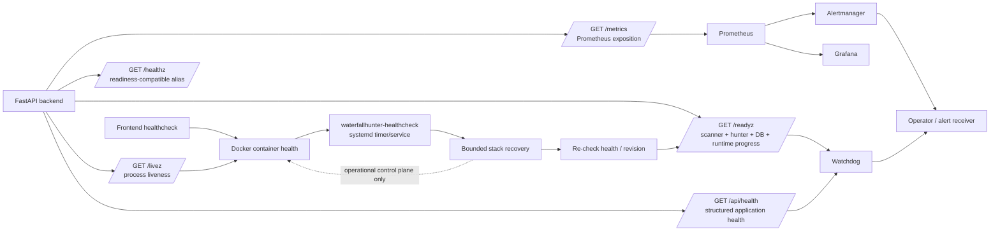

# D14 — Observability / Incident Flow

Source baseline: `main@65c063ffea6209ecd84b224656bbc627ff811898`

## Purpose

Show how application health, Prometheus metrics, container healthchecks, watchdog checks, Grafana/Alertmanager, and bounded systemd recovery relate without becoming part of decision semantics.

Authoritative references: `docs/OPERATIONS.md`, backend health/metrics routes, `watchdog/`, `deploy/`, systemd assets, Prometheus/Grafana/Alertmanager configuration.

## Health semantics

- `/livez` answers process liveness only.
- `/readyz` evaluates the readiness boundary that includes scanner/hunter/database/runtime progress.
- `/healthz` is the readiness-compatible health alias.
- `/api/health` is the structured application-health snapshot used by operational surfaces.
- `/metrics` exposes Prometheus metrics; it is not a decision input.
- Frontend and monitoring services have container healthchecks in the runtime topology.

## Incident/recovery boundary

The host's WaterfallHunter healthcheck timer performs bounded recovery rather than an unbounded restart loop. Recovery is followed by another health check; operational recovery does not alter ScoreV2, lifecycle, EntryDecision, evidence, or notification semantics.

## Runtime reconciliation

Read-only inspection at implementation time found nginx active, the canonical `waterfallhunter.service` present, and backend/frontend/watchdog/Prometheus/Grafana/Alertmanager containers running; backend reported healthy. This observation supports the topology only and is not a Production certification claim.
