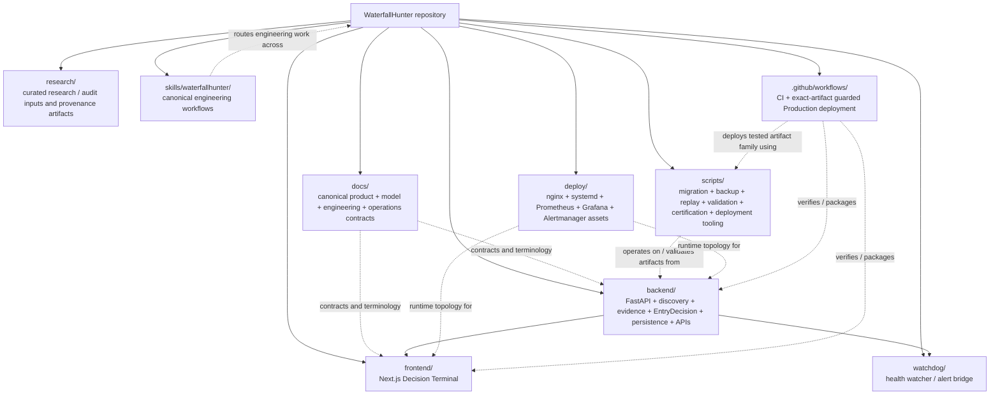

# D16 — Repository / Module Responsibility Map

Source baseline: `main@65c063ffea6209ecd84b224656bbc627ff811898`

## Purpose

Show ownership boundaries across the repository without pretending to be a complete Python/TypeScript import graph.

Authoritative references: current repository tree, `README.md`, `docs/ARCHITECTURE.md`, repository-local WaterfallHunter engineering skills.

## Responsibility boundaries

- `backend/` owns authoritative market normalization, evidence processing, canonical decision semantics, persistence, migrations, replay/outcome services, and API surfaces.
- `frontend/` owns presentation and transport consumption of canonical contracts. It must not become an independent decision/eligibility authority.
- `watchdog/` owns health observation/recovery signalling, not model decisions.
- `deploy/` owns runtime/edge/observability configuration assets; host-owned runtime state remains outside Git where documented.
- `scripts/` owns bounded operational tooling such as migration, backup/restore, replay/calibration, release validation, deployment, and certification helpers.
- `docs/` records canonical product, model, scientific, dashboard, developer, and operations contracts.
- `research/` holds curated provenance/audit material; generated datasets and runtime evidence are not treated as ordinary source files.
- `skills/waterfallhunter/` defines repository-local engineering ownership and verification workflows; it does not replace domain source code.
- `.github/workflows/` owns exact-SHA CI and guarded deployment orchestration over tested artifacts.

## Dependency note

Arrows beyond the top-level ownership tree are intentionally sparse and semantic. They show important responsibility direction, not every import or process call. The canonical backend remains the source of decision truth consumed by the frontend and operational surfaces.
