# WaterfallHunter Architecture Diagram Suite Implementation Plan

> **For agentic workers:** REQUIRED SUB-SKILL: Use superpowers:subagent-driven-development (recommended) or superpowers:executing-plans to implement this plan task-by-task. Steps use checkbox (`- [ ]`) syntax for tracking.

**Goal:** Build and verify a source-bound suite of 17 canonical Mermaid architecture diagrams that explain WaterfallHunter's product boundary, runtime topology, decision semantics, data/persistence flows, scientific validation, observability, and release certification without changing runtime behavior.

**Architecture:** The repository source of truth remains current GitHub code/contracts. Each diagram is a focused Markdown document under `docs/diagrams/` with one canonical Mermaid block, exact source-baseline SHA, authoritative source references, interpretation notes, and safety caveats. `docs/diagrams/README.md` is the navigational index; selected canonical docs link to the suite rather than duplicating it.

**Tech Stack:** Markdown, Mermaid, GitHub-rendered documentation, Mermaid Chart validation, GitHub connector, read-only Remote Desktop Commander reconciliation.

**Spec:** `docs/superpowers/specs/2026-08-31-waterfallhunter-architecture-diagram-suite-design.md`

## Global Constraints

- Source design baseline is `main@65c063ffea6209ecd84b224656bbc627ff811898`; resolve current `main` again before final completion and reconcile relevant drift.
- Product mode remains `SIGNAL_ONLY`; `LIVE_TRADING_ENABLED=false` is mandatory.
- No order placement or cancellation path may appear in any diagram.
- Do not change ScoreV2 weights/evidence semantics, decision thresholds, lifecycle semantics, strict/experimental eligibility, anti-chase, immutable provenance, persistence-before-notification ordering, scientific validation policy, or Production execution policy.
- Missing/stale evidence is unavailable or blocking evidence according to canonical contracts; never portray missing data as bullish/bearish evidence.
- Only `ENTRY_READY` may be represented as a proactive entry signal.
- Lifecycle `TRIGGERED` must never be represented as equivalent to `ENTRY_READY`.
- Frontend diagrams must consume canonical backend contracts; do not duplicate or invent frontend decision/ranking logic.
- Mermaid source in Git is canonical. Secondary whiteboard/visual exports are optional and non-authoritative.
- Remote Desktop Commander usage for this work is read-only unless a separate explicit Production authorization is given.
- Documentation-only change: no runtime code, DB schema, service, container, environment, or Production mutation.

---

## File Structure

### New canonical diagram documents

- `docs/diagrams/README.md` — diagram-suite index, grouping, terminology, freshness policy.
- `docs/diagrams/01-system-context.md` — D01 system context.
- `docs/diagrams/02-runtime-deployment-topology.md` — D02 actual deployment topology.
- `docs/diagrams/03-end-to-end-data-pipeline.md` — D03 market-to-terminal data pipeline.
- `docs/diagrams/04-canonical-decision-flow.md` — D04 canonical EntryDecision logic.
- `docs/diagrams/05-lifecycle-state-machine.md` — D05 lifecycle state machine.
- `docs/diagrams/06-entry-decision-state-machine.md` — D06 public decision state machine.
- `docs/diagrams/07-evidence-architecture.md` — D07 evidence families and convergence.
- `docs/diagrams/08-entry-decision-transaction-sequence.md` — D08 decision/persistence sequence.
- `docs/diagrams/09-tradeplan-risk-flow.md` — D09 TradePlan/TP-SL/leverage evidence flow.
- `docs/diagrams/10-persistence-erd.md` — D10 domain-critical SQLite ERD.
- `docs/diagrams/11-dashboard-api-sse.md` — D11 dashboard/API/SSE transport.
- `docs/diagrams/12-notification-delivery.md` — D12 durable notification flow.
- `docs/diagrams/13-scientific-validation.md` — D13 replay/outcomes/scientific validation.
- `docs/diagrams/14-observability-incident-flow.md` — D14 observability/recovery flow.
- `docs/diagrams/15-ci-release-production-certification.md` — D15 CI/release/deploy/certification gates.
- `docs/diagrams/16-repository-responsibility-map.md` — D16 repository ownership/dependency map.
- `docs/diagrams/17-master-architecture-map.md` — D17 compact layered index map.

### Existing documents to update only with concise links

- `README.md` — add one Architecture Diagram Suite entry in the documentation/architecture area if a natural existing anchor exists.
- `docs/ARCHITECTURE.md` — add a short pointer to the diagram suite.
- `docs/DECISION_ENGINE.md` — link decision/lifecycle diagrams.
- `docs/DASHBOARD.md` — link dashboard/API/SSE diagram.
- `docs/OPERATIONS.md` — link runtime/observability/release diagrams.

No other existing documentation is modified unless source inspection proves a specific link is necessary for navigation.

---

### Task 1: Create the diagram index and shared terminology contract

**Files:**
- Create: `docs/diagrams/README.md`

**Interfaces:**
- Consumes: approved design spec and canonical terms from `README.md`, `docs/ARCHITECTURE.md`, `docs/DECISION_ENGINE.md`, `docs/DASHBOARD.md`, `docs/MODEL.md`.
- Produces: stable diagram IDs `D01` through `D17`, shared terms, suite navigation, source-freshness policy used by all later tasks.

- [ ] **Step 1: Re-read current canonical terminology at the implementation branch baseline**

Read and confirm exact terms:

```text
SIGNAL_ONLY
EntryDecision
NO_TRADE | FORMING | ENTRY_READY | ACTIVE | LATE | INVALIDATED | EXPIRED | UNAVAILABLE
WATCH -> FUEL-RICH -> PRE-TRIGGER -> ARMED -> TRIGGERED -> EXHAUSTED / INVALIDATED
Managed SQLite
Decision Terminal
production evidence
feature-equivalent replay
```

Expected: no semantic wording in the index contradicts canonical docs.

- [ ] **Step 2: Create the index with grouped navigation**

Use this exact group structure:

```markdown
# WaterfallHunter Architecture Diagram Suite

Source baseline: `<implementation-baseline-sha>`

## Product and runtime
- D01 System Context
- D02 Runtime Deployment Topology
- D03 End-to-End Data Pipeline

## Decision semantics and evidence
- D04 Canonical Decision Flow
- D05 Lifecycle State Machine
- D06 EntryDecision State Machine
- D07 Evidence Architecture
- D08 Entry Decision Transaction Sequence
- D09 TradePlan / Risk Flow

## Persistence and product delivery
- D10 Persistence ERD
- D11 Dashboard / API / SSE
- D12 Notification Delivery

## Research, operations, and release
- D13 Scientific Validation
- D14 Observability / Incident Flow
- D15 CI / Release / Production Certification
- D16 Repository Responsibility Map
- D17 Master Architecture Map
```

Include a short legend explaining solid vs dashed edges and the invariant that only `ENTRY_READY` is proactive.

- [ ] **Step 3: Verify index links are initially intentionally unresolved only for files not yet created**

Expected: all target filenames exactly match the File Structure section above; no extra aliases.

- [ ] **Step 4: Commit Task 1**

```bash
git add docs/diagrams/README.md
git commit -m "docs: add architecture diagram suite index"
```

---

### Task 2: Build system context, runtime topology, and end-to-end pipeline diagrams

**Files:**
- Create: `docs/diagrams/01-system-context.md`
- Create: `docs/diagrams/02-runtime-deployment-topology.md`
- Create: `docs/diagrams/03-end-to-end-data-pipeline.md`

**Interfaces:**
- Consumes: `README.md`, `docs/ARCHITECTURE.md`, `docs/OPERATIONS.md`, current `docker-compose.yml`, current Production read-only topology.
- Produces: stable high-level system/runtime/data-flow views referenced by D17 and existing docs.

- [ ] **Step 1: Reconcile source and read-only runtime topology**

Confirm at minimum:

```text
browser -> nginx -> Next.js frontend -> FastAPI backend -> managed SQLite
backend/watchdog/Prometheus/Grafana/Alertmanager under Docker Compose
nginx on host edge
persistent data volume preserved across runtime replacement
```

If Production no longer matches the design-time facts, record the difference in the diagram notes instead of silently preferring either source or runtime.

- [ ] **Step 2: Create D01 with a bounded system context flowchart**

Start from this canonical shape and refine labels only from source evidence:

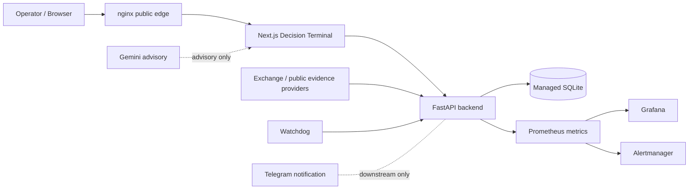

Correct any edge direction that source proves is inaccurate; do not imply Telegram or Gemini defines EntryDecision.

- [ ] **Step 3: Render D01 in Mermaid Chart**

Expected: syntax valid, no overlapping labels that make trust boundaries unreadable.

- [ ] **Step 4: Create D02 with deployment subgraphs**

Required boundaries:

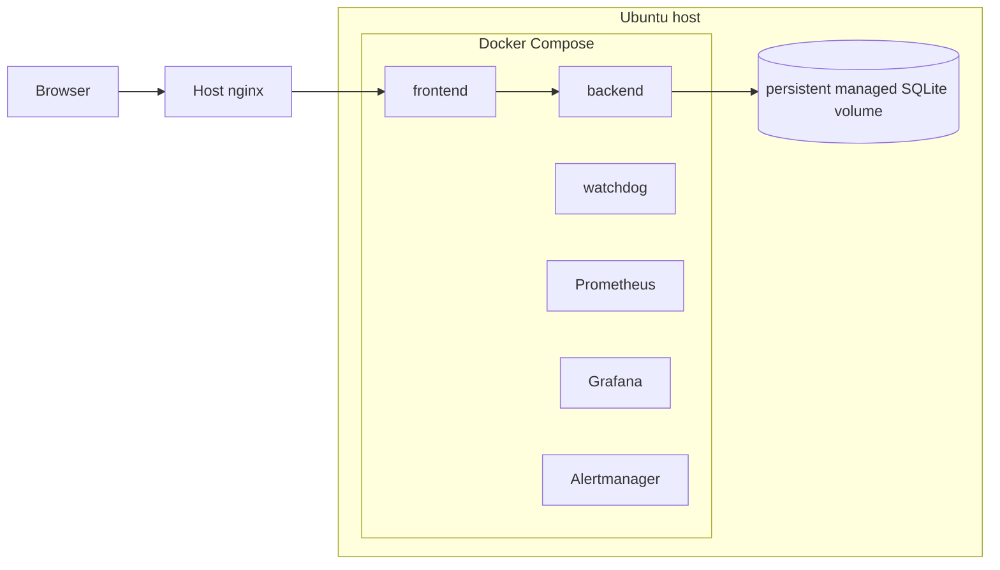

Add loopback/internal-network notes only where source/runtime supports them.

- [ ] **Step 5: Render D02 in Mermaid Chart**

Expected: valid Mermaid and clear host/container boundary.

- [ ] **Step 6: Create D03 using the canonical pipeline**

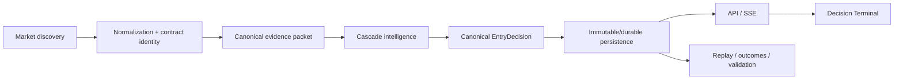

Include a dashed non-authoritative AI/advisory branch only if source references make the relationship explicit.

- [ ] **Step 7: Render D03 in Mermaid Chart**

Expected: no research path feeds directly into proactive actionability.

- [ ] **Step 8: Commit Task 2**

```bash
git add docs/diagrams/01-system-context.md \
        docs/diagrams/02-runtime-deployment-topology.md \
        docs/diagrams/03-end-to-end-data-pipeline.md
git commit -m "docs: add system runtime and pipeline diagrams"
```

---

### Task 3: Build canonical decision, lifecycle, EntryDecision, and evidence diagrams

**Files:**
- Create: `docs/diagrams/04-canonical-decision-flow.md`
- Create: `docs/diagrams/05-lifecycle-state-machine.md`
- Create: `docs/diagrams/06-entry-decision-state-machine.md`
- Create: `docs/diagrams/07-evidence-architecture.md`

**Interfaces:**
- Consumes: `docs/DECISION_ENGINE.md`, `docs/MODEL.md`, current decision/lifecycle code and tests, strategy-score-lifecycle canonical skill.
- Produces: authoritative semantic views used by D08, D09, D17 and Decision Engine links.

- [ ] **Step 1: Reconcile current decision thresholds and hard invalidator terminology**

Confirm source still supports:

```text
ENTRY_READY >= 78
FORMING >= 55
otherwise NO_TRADE
```

and that all thresholds remain subject to mandatory timing/direction/execution checks and anti-chase. If current `main` changed these values after the design baseline, use current source and document the drift.

- [ ] **Step 2: Create D04 canonical decision flow**

Use a decision graph with explicit fail-closed exits:

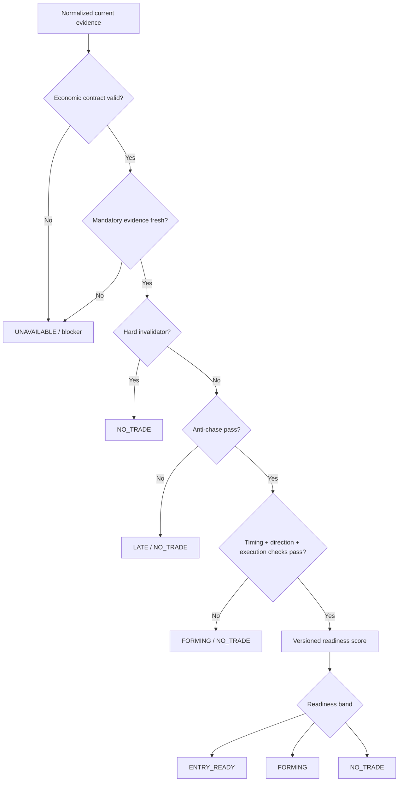

Do not manufacture one-to-one mappings for branches where current source uses more specific reason codes; describe nuance below the diagram.

- [ ] **Step 3: Render D04 in Mermaid Chart**

Expected: only the `ENTRY_READY` node is labelled proactive/actionable.

- [ ] **Step 4: Create D05 lifecycle state machine independently**

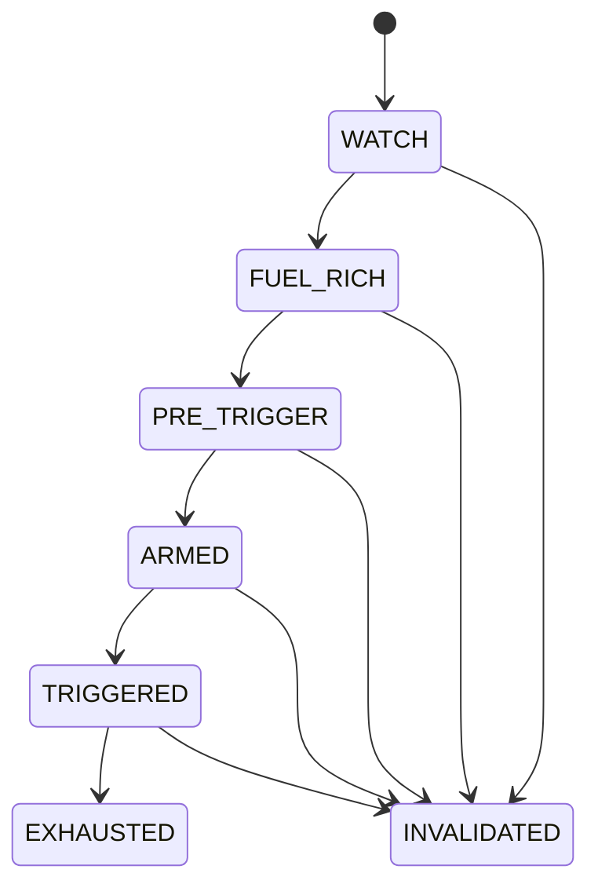

Use human-readable labels `FUEL-RICH` and `PRE-TRIGGER` if Mermaid state aliases are required.

- [ ] **Step 5: Render D05 and visually verify it contains an explicit note `TRIGGERED != ENTRY_READY`**

Expected: lifecycle is clearly labelled contextual/non-actionable by itself.

- [ ] **Step 6: Create D06 EntryDecision state machine**

Ground transition edges in current decision/persistence source. The document must contain all public states:

```text
NO_TRADE
FORMING
ENTRY_READY
ACTIVE
LATE
INVALIDATED
EXPIRED
UNAVAILABLE
```

Use explicit post-entry transitions from `ENTRY_READY` only where source proves them. Do not invent reverse transitions.

- [ ] **Step 7: Render D06 in Mermaid Chart**

Expected: `ENTRY_READY` is the only proactive signal state; `ACTIVE` explicitly says no new entry instruction.

- [ ] **Step 8: Create D07 evidence architecture**

Required evidence-family nodes:

```text
Market identity
Structure and timing
Derivatives
Aggressive flow
Liquidation / cascade
Liquidity / execution
Cross-exchange
Market regime / relative weakness
Freshness / provenance
```

All converge through a canonical evidence packet rather than directly into UI actionability.

- [ ] **Step 9: Render D07 in Mermaid Chart**

Expected: optional/unavailable evidence is visually distinct from hard invalidators without using color alone.

- [ ] **Step 10: Commit Task 3**

```bash
git add docs/diagrams/04-canonical-decision-flow.md \
        docs/diagrams/05-lifecycle-state-machine.md \
        docs/diagrams/06-entry-decision-state-machine.md \
        docs/diagrams/07-evidence-architecture.md
git commit -m "docs: add decision lifecycle and evidence diagrams"
```

---

### Task 4: Build decision transaction and TradePlan/risk diagrams

**Files:**
- Create: `docs/diagrams/08-entry-decision-transaction-sequence.md`
- Create: `docs/diagrams/09-tradeplan-risk-flow.md`

**Interfaces:**
- Consumes: current signal persistence code, entry-decision store, metadata/provenance code, outbox code, position calculator, execution planning/risk code, migrations 0003/0004/0006/0007.
- Produces: sequence/flow views used by D10, D12, D17.

- [ ] **Step 1: Trace the exact persistence-before-notification sequence from current source**

Record exact actor names before diagramming. At minimum verify whether the canonical path contains distinct concepts equivalent to:

```text
Evaluator
EntryDecision
Metadata/provenance validation
SQLite transaction
immutable decision/event persistence
outbox
notification worker
```

- [ ] **Step 2: Create D08 sequence diagram**

Use this shape only after aligning actor names to current code:

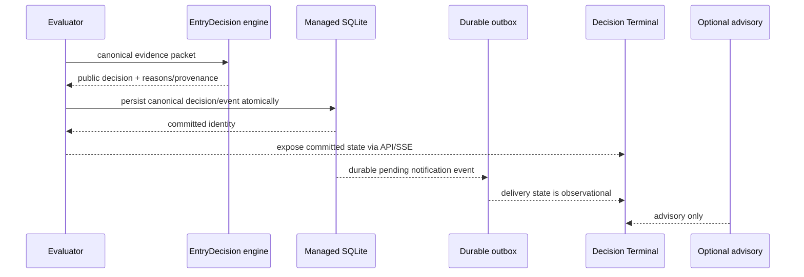

If actual outbox creation is in the same transaction, represent it as such explicitly.

- [ ] **Step 3: Render D08 in Mermaid Chart**

Expected: no network notification precedes successful persistence.

- [ ] **Step 4: Trace current TradePlan/TP-SL/leverage source path**

Confirm current canonical classes/functions and distinguish:

```text
venue/contract constraints
mark/reference price
entry geometry
stop geometry
TP geometry
fees/slippage/funding where applicable
leverage/risk ceiling
feasibility/unavailable result
```

- [ ] **Step 5: Create D09 without any order-placement node**

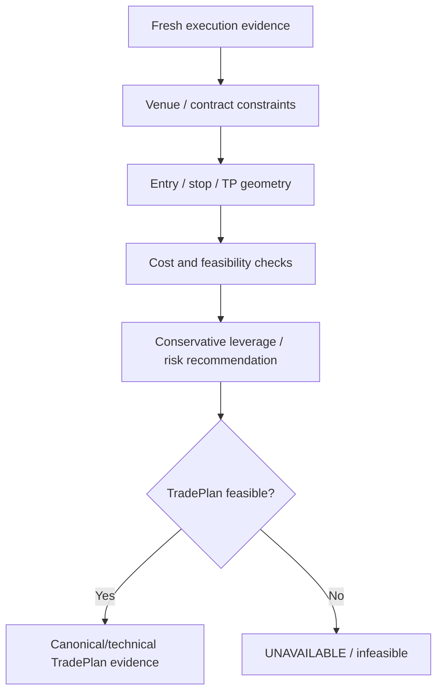

Refine labels to exact source terminology; explicitly state that feasibility evidence does not place an order.

- [ ] **Step 6: Render D09 in Mermaid Chart**

Expected: no live execution edge.

- [ ] **Step 7: Commit Task 4**

```bash
git add docs/diagrams/08-entry-decision-transaction-sequence.md \
        docs/diagrams/09-tradeplan-risk-flow.md
git commit -m "docs: add decision transaction and risk diagrams"
```

---

### Task 5: Build the domain-critical persistence ERD

**Files:**
- Create: `docs/diagrams/10-persistence-erd.md`

**Interfaces:**
- Consumes: migrations `0001` through `0007`, schema-contract code, store/repository code.
- Produces: a bounded ERD referenced by transaction, replay, notification, and master diagrams.

- [ ] **Step 1: Read every current migration from 0001 through 0007 completely**

Extract only domain-critical entities and actual key relationships. Do not infer foreign keys that do not exist.

- [ ] **Step 2: Cross-check each ERD entity against current store/repository usage**

Classify each proposed edge as one of:

```text
FOREIGN_KEY
UNIQUE_IDENTITY
LOGICAL_LINK_ONLY
```

Only `FOREIGN_KEY` edges are rendered as relational constraints; logical links are explained in notes.

- [ ] **Step 3: Create D10 Mermaid ERD**

Skeleton only; replace table/entity names with exact current schema names:

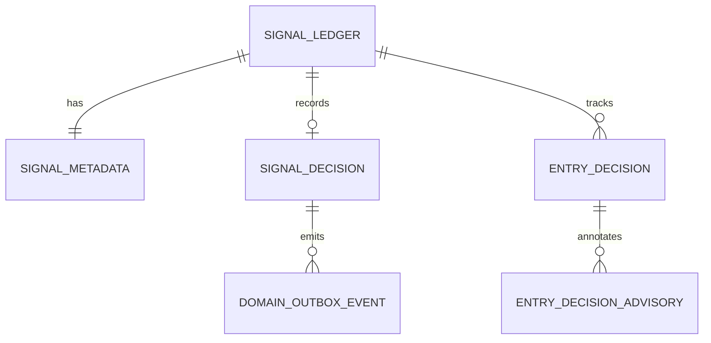

Add lifecycle-shadow and evidence/replay entities only when the relationships remain readable and source-grounded. If including them would turn D10 into a schema dump, add a secondary textual table instead of more graph nodes.

- [ ] **Step 4: Render D10 in Mermaid Chart**

Expected: parser success and every rendered relationship traceable to source.

- [ ] **Step 5: Commit Task 5**

```bash
git add docs/diagrams/10-persistence-erd.md
git commit -m "docs: add persistence architecture ERD"
```

---

### Task 6: Build dashboard/API/SSE and durable notification diagrams

**Files:**
- Create: `docs/diagrams/11-dashboard-api-sse.md`
- Create: `docs/diagrams/12-notification-delivery.md`

**Interfaces:**
- Consumes: current dashboard contracts/routes/SSE implementation, frontend transport logic, notification outbox/delivery worker, `docs/DASHBOARD.md`.
- Produces: product-delivery diagrams referenced by D17 and canonical docs.

- [ ] **Step 1: Trace current dashboard transport source**

Confirm actual endpoints and behaviors, including current equivalents of:

```text
GET /api/candidates
GET /api/stream
initial/bootstrap snapshot
SSE event IDs/replay
polling fallback
lazy-loaded research endpoints
```

Do not carry old OOM/audit assumptions into the diagram unless current source still implements them.

- [ ] **Step 2: Create D11**

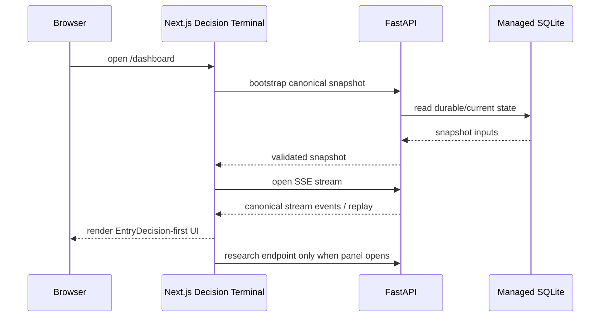

Add polling fallback based on exact current frontend source.

- [ ] **Step 3: Render D11 in Mermaid Chart**

Expected: no frontend scoring or eligibility algorithm node.

- [ ] **Step 4: Trace current notification worker states and cutover requirements**

Confirm exact concepts for:

```text
pending event
lease
retry/backoff
HTTP 429 / retry-wait
uncertain/dead-letter if still current
release-scoped cutover
STRICT vs EXPERIMENTAL network-send boundary
```

- [ ] **Step 5: Create D12**

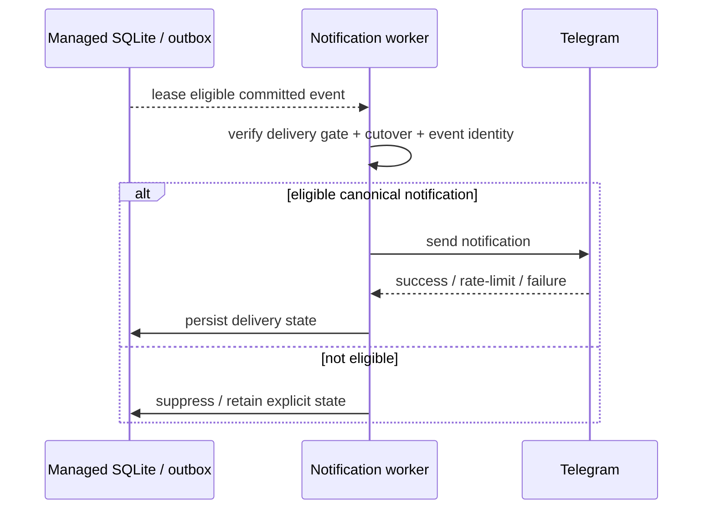

Refine terminology to current code; emphasize that delivery cannot alter the canonical decision.

- [ ] **Step 6: Render D12 in Mermaid Chart**

Expected: notification is downstream-only.

- [ ] **Step 7: Commit Task 6**

```bash
git add docs/diagrams/11-dashboard-api-sse.md \
        docs/diagrams/12-notification-delivery.md
git commit -m "docs: add dashboard streaming and notification diagrams"
```

---

### Task 7: Build replay, historical outcomes, and scientific validation diagram

**Files:**
- Create: `docs/diagrams/13-scientific-validation.md`

**Interfaces:**
- Consumes: current Production Evidence v9 implementation/PR #96, feature replay source/docs, operational historical outcomes, strict scientific validation policy/scripts.
- Produces: explicit research/promotion-boundary diagram referenced by D17.

- [ ] **Step 1: Reconcile old replay documentation with current v9 source**

Do not copy stale version labels from `docs/feature-equivalent-replay.md` if current source/PR #96 supersedes them. Record exact current evidence and replay compatibility versions in notes.

- [ ] **Step 2: Confirm strict scientific policy from current source**

At minimum verify whether the current policy still requires:

```text
STRICT-only provenance-complete cohort
chronological development/calibration/holdout
purge/embargo
walk-forward development folds
untouched holdout
bootstrap confidence intervals
OWNER_REVIEW_REQUIRED or DO_NOT_PROMOTE
promotion_allowed=false
live_execution_allowed=false
```

- [ ] **Step 3: Create D13**

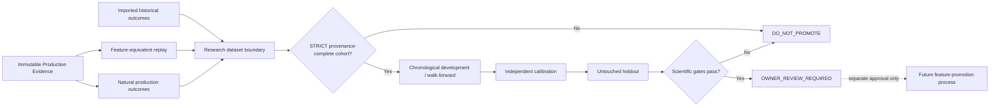

Do not draw promotion as automatic.

- [ ] **Step 4: Render D13 in Mermaid Chart**

Expected: scientific outputs cannot reach Production/actionability without an explicit separate approval boundary.

- [ ] **Step 5: Commit Task 7**

```bash
git add docs/diagrams/13-scientific-validation.md
git commit -m "docs: add scientific validation architecture diagram"
```

---

### Task 8: Build observability and incident/recovery diagram

**Files:**
- Create: `docs/diagrams/14-observability-incident-flow.md`

**Interfaces:**
- Consumes: current Prometheus config, Grafana dashboards, Alertmanager config, watchdog source, health routes, systemd health recovery.
- Produces: operations view referenced by D17 and `docs/OPERATIONS.md`.

- [ ] **Step 1: Reconcile current health/metrics/recovery sources**

Confirm distinctions among:

```text
/livez
/readyz
/healthz
/api/health
/metrics
container healthchecks
watchdog
systemd bounded health recovery
```

- [ ] **Step 2: Create D14**

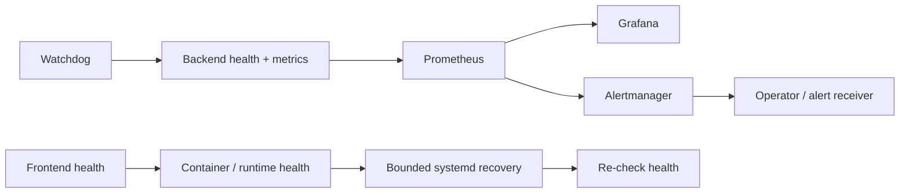

Correct directions from current source; explicitly label recovery as operational, not decision logic.

- [ ] **Step 3: Render D14 in Mermaid Chart**

Expected: clear separation of monitoring and trading/decision semantics.

- [ ] **Step 4: Commit Task 8**

```bash
git add docs/diagrams/14-observability-incident-flow.md
git commit -m "docs: add observability and recovery diagram"
```

---

### Task 9: Build CI, release, deployment, rollback, and Production certification diagram

**Files:**
- Create: `docs/diagrams/15-ci-release-production-certification.md`

**Interfaces:**
- Consumes: `.github/workflows/ci.yml`, production deployment workflow/scripts, release-production-certification skill, backup/migration/certification scripts, current operations docs.
- Produces: explicit gate diagram preventing CI/deploy/Production-state conflation.

- [ ] **Step 1: Trace exact current release gates and authority boundaries**

Record the current named checks/artifacts and the distinction among:

```text
source commit
CI/review
immutable artifact/image
backup/preflight
migration compatibility
manual/guarded deployment
health/smoke/runtime verification
rollback
Production certification
```

- [ ] **Step 2: Create D15**

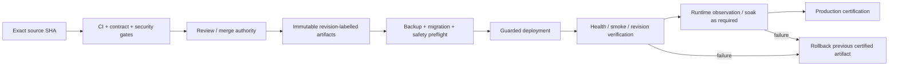

Add readiness labels only from repository release skill; do not let the diagram imply that `MERGE_READY` equals `DEPLOY_READY`.

- [ ] **Step 3: Render D15 in Mermaid Chart**

Expected: explicit text `CI success != Production verification` in the document notes.

- [ ] **Step 4: Commit Task 9**

```bash
git add docs/diagrams/15-ci-release-production-certification.md
git commit -m "docs: add release and production certification diagram"
```

---

### Task 10: Build repository/module responsibility map

**Files:**
- Create: `docs/diagrams/16-repository-responsibility-map.md`

**Interfaces:**
- Consumes: current repository tree, README repository map, architecture skill routing.
- Produces: ownership/dependency map used by D17 and developer navigation.

- [ ] **Step 1: Re-list current top-level repository tree**

At minimum reconcile:

```text
backend/
frontend/
watchdog/
deploy/
scripts/
docs/
research/
skills/waterfallhunter/
.github/workflows/
```

- [ ] **Step 2: Create D16**

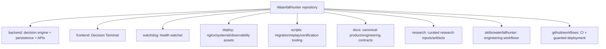

Add dependency-direction edges sparingly; this is a responsibility map, not a full import graph.

- [ ] **Step 3: Render D16 in Mermaid Chart**

Expected: readable at GitHub page width.

- [ ] **Step 4: Commit Task 10**

```bash
git add docs/diagrams/16-repository-responsibility-map.md
git commit -m "docs: add repository responsibility diagram"
```

---

### Task 11: Build the master architecture index map

**Files:**
- Create: `docs/diagrams/17-master-architecture-map.md`

**Interfaces:**
- Consumes: D01-D16 final terminology and boundaries.
- Produces: one layered navigation map with links/labels to the focused views.

- [ ] **Step 1: Extract only one node per major concern from D01-D16**

The master map must stay compact. Target major layers:

```text
Inputs
Evidence pipeline
Decision semantics
Persistence
Product delivery
Research/validation
Observability
Release/operations
```

- [ ] **Step 2: Create D17**

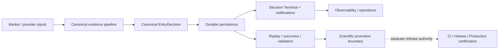

Below the diagram, map each layer to D01-D16 links.

- [ ] **Step 3: Render D17 in Mermaid Chart**

Expected: it functions as an index, not a duplicate mega-chart.

- [ ] **Step 4: Commit Task 11**

```bash
git add docs/diagrams/17-master-architecture-map.md
git commit -m "docs: add master architecture map"
```

---

### Task 12: Link the diagram suite from canonical documentation

**Files:**
- Modify: `README.md`
- Modify: `docs/ARCHITECTURE.md`
- Modify: `docs/DECISION_ENGINE.md`
- Modify: `docs/DASHBOARD.md`
- Modify: `docs/OPERATIONS.md`

**Interfaces:**
- Consumes: completed D01-D17 and current canonical docs.
- Produces: discoverable navigation without duplicating content or changing semantics.

- [ ] **Step 1: Add one concise README link**

Add a single entry such as:

```markdown
[Architecture diagram suite](docs/diagrams/README.md)
```

Place it in the existing architecture/documentation index rather than adding a new large section.

- [ ] **Step 2: Add focused links to `docs/ARCHITECTURE.md`**

Link at minimum D01, D02, D03, and D17.

- [ ] **Step 3: Add focused links to `docs/DECISION_ENGINE.md`**

Link D04, D05, D06, D08, and D09 without changing decision wording.

- [ ] **Step 4: Add focused link to `docs/DASHBOARD.md`**

Link D11 and optionally D12 where notification behavior is mentioned.

- [ ] **Step 5: Add focused links to `docs/OPERATIONS.md`**

Link D02, D14, and D15.

- [ ] **Step 6: Review the diff for semantic wording changes**

Expected: only navigation/link additions outside `docs/diagrams/`; no thresholds, states, safety policies, or operational commands changed.

- [ ] **Step 7: Commit Task 12**

```bash
git add README.md docs/ARCHITECTURE.md docs/DECISION_ENGINE.md docs/DASHBOARD.md docs/OPERATIONS.md
git commit -m "docs: link canonical docs to architecture diagrams"
```

---

### Task 13: Perform exact-artifact Mermaid, link, drift, and documentation verification

**Files:**
- Verify: all `docs/diagrams/*.md`
- Verify: modified canonical docs
- Modify only if validation identifies a concrete documentation defect.

**Interfaces:**
- Consumes: exact final branch artifact from Tasks 1-12.
- Produces: verification-regression evidence sufficient for documentation `CODE_READY`; no Production readiness claim.

- [ ] **Step 1: Resolve current `main` SHA again**

Compare current `main` against the original design baseline:

```text
65c063ffea6209ecd84b224656bbc627ff811898
```

Inspect intervening commits touching architecture, decision contracts, migrations/schema, dashboard/SSE, notification, observability, replay/scientific validation, or release/deployment.

Expected: every relevant drift is either incorporated into diagrams or documented as an unresolved limitation.

- [ ] **Step 2: Render every Mermaid diagram independently in Mermaid Chart**

Required validation matrix:

```text
D01 PASS/FAIL
D02 PASS/FAIL
D03 PASS/FAIL
D04 PASS/FAIL
D05 PASS/FAIL
D06 PASS/FAIL
D07 PASS/FAIL
D08 PASS/FAIL
D09 PASS/FAIL
D10 PASS/FAIL
D11 PASS/FAIL
D12 PASS/FAIL
D13 PASS/FAIL
D14 PASS/FAIL
D15 PASS/FAIL
D16 PASS/FAIL
D17 PASS/FAIL
```

Fix syntax/layout problems immediately and re-render the affected diagram.

- [ ] **Step 3: Run a terminology/invariant review**

Verify all of the following by direct search/review:

```text
Only ENTRY_READY is proactive/actionable.
TRIGGERED is never equated with ENTRY_READY.
No order-placement/cancellation node exists.
SIGNAL_ONLY is preserved.
Persistence precedes notification.
Missing/unavailable evidence is never directional evidence.
Frontend does not contain a duplicated decision/ranking algorithm in diagrams.
Scientific promotion is never automatic.
CI success is never represented as Production verification.
```

- [ ] **Step 4: Validate all Markdown links from `docs/diagrams/README.md` and modified canonical docs**

Use repository-relative link checks. Every target must exist on the exact branch artifact.

- [ ] **Step 5: Run documentation hygiene checks**

At minimum:

```bash
git diff --check main...HEAD
```

If the repository has an existing documentation/link checker, run it too. Do not add a new dependency only for this documentation task.

- [ ] **Step 6: Re-read the exact final diff**

Expected changed-file set:

```text
docs/diagrams/README.md
docs/diagrams/01-system-context.md
...
docs/diagrams/17-master-architecture-map.md
README.md
docs/ARCHITECTURE.md
docs/DECISION_ENGINE.md
docs/DASHBOARD.md
docs/OPERATIONS.md
docs/superpowers/specs/2026-08-31-waterfallhunter-architecture-diagram-suite-design.md
docs/superpowers/plans/2026-08-31-waterfallhunter-architecture-diagram-suite-implementation.md
```

No runtime/source/test/migration/Compose file should be changed.

- [ ] **Step 7: Record verification results in the completion report**

Report:

```text
exact final SHA
changed files
17 Mermaid render results
link validation result
git diff --check result
source-drift reconciliation result
runtime mutation: NONE
Production mutation: NONE
protected-invariant changes: NONE
remaining unknowns/limitations
```

- [ ] **Step 8: Commit any final validation-only documentation fixes**

```bash
git add docs README.md
git commit -m "docs: verify architecture diagram suite"
```

Skip this commit if validation requires no changes.

---

## Plan Self-Review Result

### Spec coverage

- D01-D17: covered by Tasks 2-11.
- source-bound SHA/freshness contract: Tasks 1 and 13.
- canonical Mermaid source: every diagram task plus Task 13 rendering.
- read-only Production reconciliation: Task 2 and final drift verification; no mutation authorization.
- protected model/safety invariants: Global Constraints and Task 13 invariant review.
- canonical-doc discoverability: Task 12.
- exact-artifact verification: Task 13.
- secondary visual tools: intentionally optional; not required for canonical acceptance.

### Placeholder scan

No `TBD`, implementation placeholders, unspecified test requests, or deferred mandatory work remain in this plan. Diagram skeletons are explicit starting contracts and every task requires source reconciliation before finalizing them.

### Interface consistency

Diagram IDs, filenames, canonical terms, and cross-task dependencies match the approved design spec. D17 consumes D01-D16; Task 12 links only completed diagrams; Task 13 verifies the exact final artifact.
